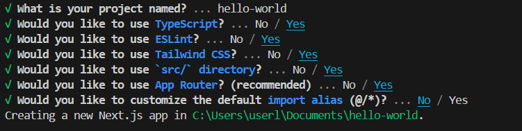
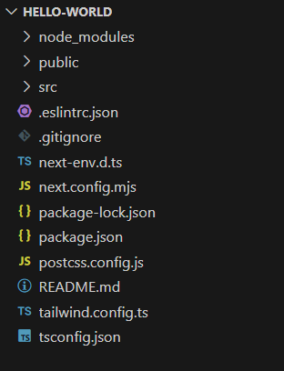
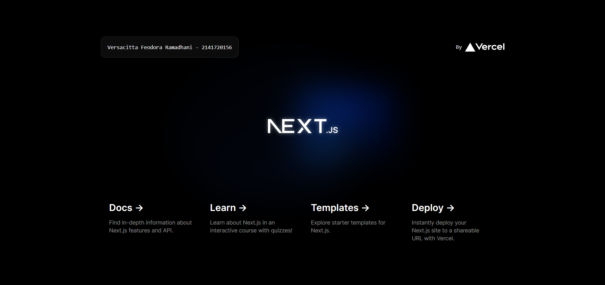
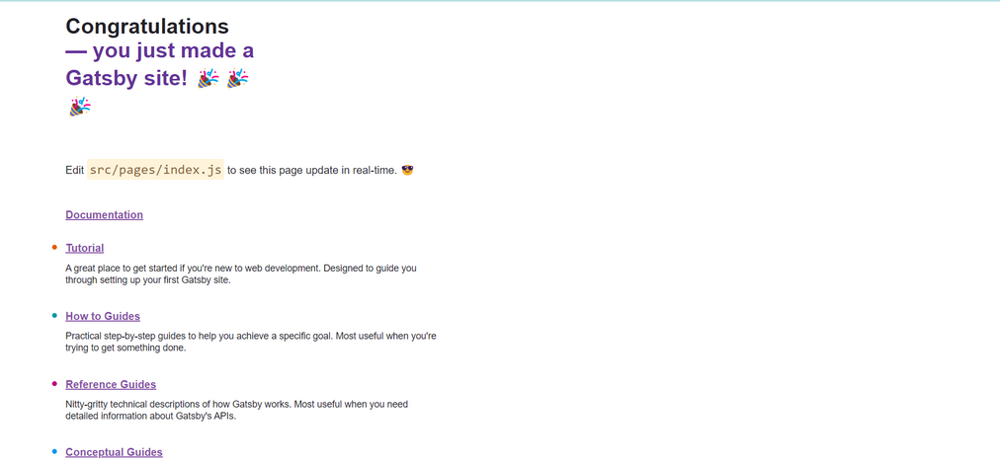
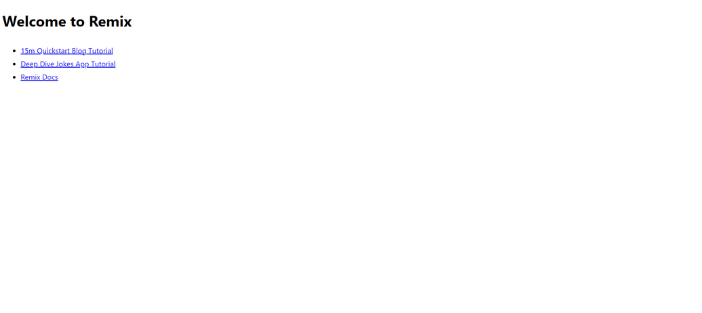

## Laporan Praktikum

|  | Pemrograman Berbasis Framework 2024 |
|--|--|
| NIM |  2141720156|
| Nama |  Versacitta Feodora Ramadhani |
| Kelas | TI - 3I |

### Jawaban Soal 1

In the picture, please browse what is meant by:

#### - TypeScript
    TypeScript is a syntactic superset of JavaScript which adds static typing. It also means that TypeScript adds syntax on top of JavaScript, allowing developers to specify the types of data being passed around within the code, and has the ability to report errors when the types don't match.

#### - ESLint
    ESLint is a tool for identifying and reporting on patterns found in ECMAScript/JavaScript code, with the goal of making code more consistent and avoiding bugs.

#### - Tailwind CSS
    Tailwind CSS is a Utility first CSS framework for building rapid custom UI. It is a highly customizable, low-level CSS framework that gives all of the building blocks that is needed while having small build size.

#### - Router Apps
    It is a new model exclusively from Next.js for building applications using React's latest features such as Server Components, Streaming with Suspense, and Server Actions.

#### - Import alias
    Developers can use import aliases to create shorter and more descriptive import paths for your modules. This can make your codebase cleaner and more maintainable, as it avoids long relative paths that might become cumbersome, especially in larger projects.

### Jawaban Soal 2

In the project structure, explain the use of each folder and file!

#### - .next folder
    Used to store page cache and some features to speed up the project created by using command 'npm run dev'
#### - node_modules folder
    A directory created by npm that consists of various external modules and packages that the project is depending upon
#### - public folder
    A directory created to store static files (documents, images, logo, etc) to be displayed in the project later on. It is recommended to use this directory for easier path tracking.
#### - src folder
    Primary directory for the project's source codes. It is an alternate project format that typically contains all the components, pages, styles, and other assets needed for your application to function.
#### - .eslintrc.json
    Configuration file for using ESLint features
#### - .gitignore
    A text file that tells Git which folders or files to ignore in a project when sharing it through git even upon various changes
#### - next.env.d.ts
    This file ensures Next.js types are picked up by the TypeScript compiler.
#### - next.config.mjs
    Configuration file for using Next.js features
#### - package-lock.json
    Ensure that the same dependencies are installed consistently across different environments, such as development and production environments.
#### - package.json
    It records important metadata about a project which is required before publishing to NPM, and also defines functional attributes of a project that npm uses to install dependencies, run scripts, and identify the entry point to the package.
#### - postcss.config.js
    Configuration file for using PostCSS features
#### - README.md
    A text file that typically explains the overview of a project. In this case, it explains the overview of Nex.js app
#### - tailwind.config.ts
    Configuration file for using Tailwind CSS features
#### - tsconfig.json
    Configuration file for using TypeScript features

### Jawaban Soal 3

When you have successfully replaced the text, you do not need to run the npm run dev command nor do you need to reload the page in the browser. Suddenly the change appeared. Why did it happen like that? Explain!

    When npm run dev is run, Next. js sets up a development environment with features like hot module replacement (HMR) and automatic code reloading. These features enables us developers to see changes in our code immediately without the need to manually restart the server each time.

### Jawaban Soal 4
Try creating other React projects using the Remix and Gatsby frameworks. This doesn't need to be pushed, just screenshot and explain the differences between the three frameworks (including Next.js)

#### - Next.js
    Next.js is a popular open-source framework that is easy to use and integrates seamlessly with the React ecosystem. It provides server-side rendering, static site generation, and automatic code splitting. Next.js also includes built-in support for API routes, allowing developers to build full-stack applications easily.

#### - Remix
    Remix is a modern web framework for react that emphasizes convention over configuration. It has a unique feature called “nested routes” that allows developers to build more intuitive and accessible user interfaces. Remix also includes automatic code splitting and server-side rendering.

#### - Gatsby
    Gatsby is a powerful static site generator that leverages React to build fast and optimized websites. It uses GraphQL to query data from various sources and offers a rich plugin ecosystem that makes it easy to add new features and integrations. Gatsby also includes built-in support for code splitting and optimizations.